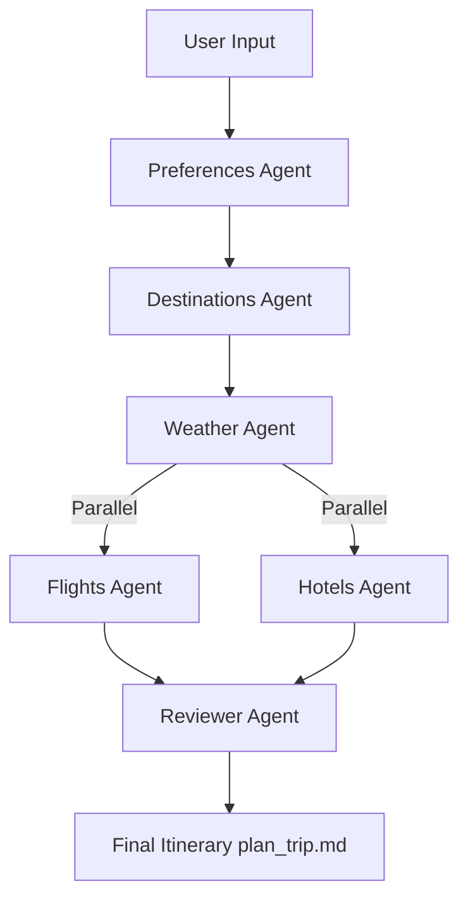

# AI Travel Planner (Multi-Agent System with LangGraph)

An **AI-powered multi-agent travel planner** built using **LangGraph** and **Ollama model**.  
This system takes in user preferences and generates a **ranked travel itinerary** by integrating **real-world APIs** (Flights, Hotels, Weather).  

---

## ✨ Features
- ✅ **Preference-based Planning**: Suggests multiple destinations based on user input.  
- ✅ **Weather Integration**: Fetches real-time weather (or forecasts with premium APIs).  
- ✅ **Flights Search**: Finds top 2–3 flight options per destination.  
- ✅ **Hotel Search**: Finds top 2–3 hotels per destination.  
- ✅ **Parallel Execution**: Flights & hotels are fetched simultaneously using LangGraph.  
- ✅ **Reviewer Agent**: Reads all outputs and generates a **final ranked itinerary**.  
- ✅ **Markdown Persistence**: Each agent saves outputs to markdown files, and the final plan is saved as `plan_trip.md`.  

---

## 🛠️ Tech Stack
- **LangGraph** (multi-agent orchestration)  
- **Python** (state management, API integration)  
- **Ollama LLMs** (reasoning + itinerary generation)  
- **APIs Used**:
  - [WeatherAPI.com](https://api.weatherapi.com) – weather data  
  - [RapidAPI Google Flights API](https://rapidapi.com/DataCrawler/api/google-flights2/) – flight search  
  - [RapidAPI Hotels.com API](https://rapidapi.com/tipsters/api/hotels-com-provider/) – hotel search  

---

## 📂 Output of plan_trip.md file
Summary & Day wise:<br/>
<br/>
Comparision & Recommendation:<br/>
<br/>
Example Input provided: <br/>
```text
Enter your preferences (budget, duration, activities, climate): 3 lakh, scuba diving, sight-seeing, good weather.
Enter the departure city: Mumbai
Enter the departure date in YYYY-MM-DD format: 2025-08-17
Enter the duration of the trip in days (only number): 3
Enter your staying preferences (e.g. format, amenities: '', ratings: '', type: '', etc.): amenities:wifi,parking, guest_rating_min:9
```
---

## ⚡ How It Works (Workflow)


---

## 🔮 Future Improvements
- Store results in a database (SQLite/Redis) instead of markdown.
- Use forecast-based weather APIs.
- Add interactive frontend (React + FastAPI).
- Visualize workflow execution (LangGraph DAG).

---
 project by msv
